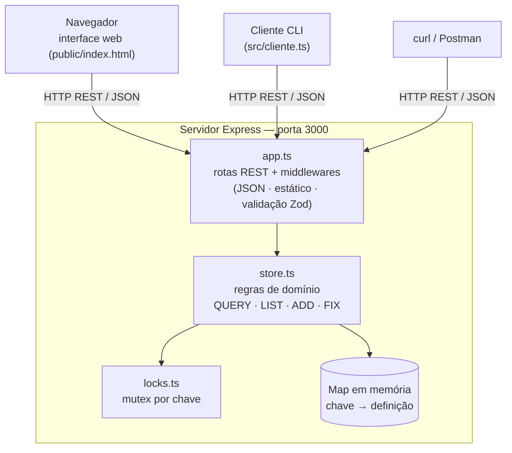
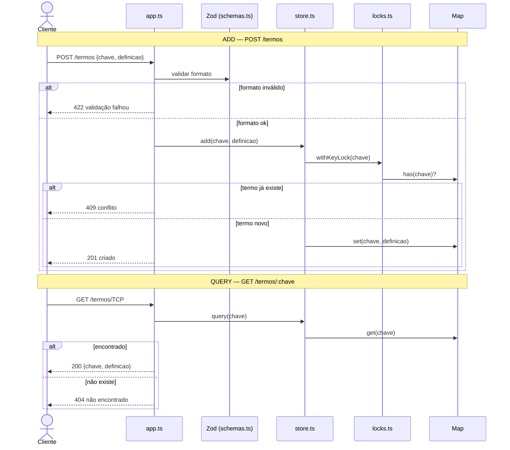
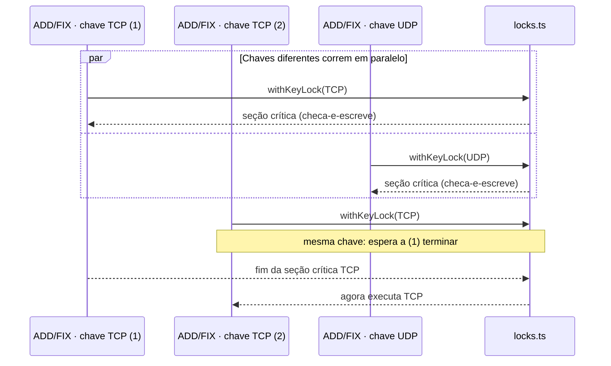

# Glossário Técnico Compartilhado

Projeto da disciplina de **Sistemas Distribuídos** (UFPE) — **Equipe 10**.

Nosso objetivo foi o da criação de um Servidor HTTP REST que mantém um **glossário de termos técnicos** (pares
`chave → definição`) em memória, atendendo a múltiplos clientes simultâneos por
meio das operações **QUERY**, **ADD**, **FIX** e **LIST**. É a reimplementação,
agora sobre um framework web, do mesmo sistema feito anteriormente com sockets.
Devido a natureza do projeto acadêmico, algumas informações serão atualizadas à medida que nosso escopo for aumentando gradualmente, com algumas informações sendo focadas na explicação dos pontos de avaliação estabelecidos, mas esperamos descrever de uma maneira clara nossas intenções.

## Tecnologias escolhidas e justificativa

| Tecnologia | Papel | Por que |
|---|---|---|
| **Node.js + Express 5** | servidor HTTP / roteamento REST | Framework sugerido no enunciado; mapeia QUERY/ADD/FIX diretamente em GET/POST/PUT. O Express 5 encaminha erros de *handlers* `async` ao tratador de erros nativamente, o que mantém os handlers limpos. |
| **TypeScript** | tipagem estática | O compilador pega erros antes da execução, reduzindo checagem manual em runtime. |
| **Zod** | validação de formato | Valida o corpo das requisições e **infere o tipo a partir do mesmo schema** — uma fonte de verdade só para formato e tipo. |
| **tsx** | execução | Roda os arquivos `.ts` diretamente, sem etapa de *build*. |

A arquitetura é um **único servidor com estado central em memória**. A
concorrência entre requisições é tratada com **bloqueio por chave** (ver
[Estratégia de locking](#estratégia-de-locking-bloqueio-transacional)).

## Arquitetura

Visão geral: clientes (o **navegador** com a interface web, o **cliente de linha
de comando** ou ferramentas como `curl`) conversam com um **único servidor
Express** pelo **protocolo REST/JSON**. O servidor é dividido em camadas de
responsabilidade única — entrada HTTP (`app.ts`), validação de formato
(`schemas.ts`), regras de domínio (`store.ts`) e controle de concorrência
(`locks.ts`) — sobre um estado central em memória (`Map`).

### Diagrama de componentes



### Funcionamento de cada elemento

| Elemento | Responsabilidade | Conversa com |
|---|---|---|
| `src/index.ts` | Ponto de entrada: sobe o servidor na porta fixa (`3000`). | `app.ts` |
| `src/app.ts` | Camada HTTP: middlewares (JSON, arquivos estáticos, validação), rotas REST e o mapeamento de erro de domínio → status HTTP. | `schemas`, `store` |
| `src/schemas.ts` | Valida o **formato** das entradas com Zod e infere os tipos do mesmo schema (uma fonte de verdade). | usado por `app` |
| `src/store.ts` | Mantém o estado (`Map`) e aplica as **regras de domínio**: unicidade no ADD, existência no FIX. | `locks`, `Map` |
| `src/locks.ts` | **Mutex por chave**: serializa operações sobre o mesmo termo; chaves diferentes seguem em paralelo. | usado por `store` |
| `public/index.html` | **Interface web** (cliente) que consome a API por `fetch`. | API via HTTP |
| `src/cliente.ts` | **Cliente de linha de comando** que consome a API. | API via HTTP |
| `src/demo-concorrencia.ts` | Exercita o `withKeyLock` para tornar a concorrência **visível**. | `locks` |

### Fluxo de uma requisição (ADD e QUERY)



### Concorrência: mutex por chave



> Os diagramas acima são escritos em **Mermaid** e renderizados automaticamente
> pelo GitHub na visualização do README.

## Estrutura de pastas

```
glossario-tecnico/
├── package.json          # dependências e scripts (dev / start / cliente / demo / carga / typecheck)
├── tsconfig.json         # TypeScript (ESM, strict, sem build)
├── README.md
├── public/
│   └── index.html        # interface web (página de apresentação + formulários; consome a API via fetch)
└── src/
    ├── index.ts              # ponto de entrada: sobe o servidor na porta fixa
    ├── app.ts                # camada HTTP: middlewares, log por requisição, rotas
    ├── store.ts              # estado em memória (Map) + operações de domínio
    ├── locks.ts              # mutex por chave (estratégia de bloqueio)
    ├── schemas.ts            # schemas Zod + tipos inferidos
    ├── log.ts                # logger estruturado (logs operacionais)
    ├── cliente.ts            # cliente de linha de comando interativo (consome a API)
    ├── demo-concorrencia.ts  # demonstração do mutex (nível unitário)
    └── carga.ts              # carga concorrente p/ verificar isolamento via logs
```

Cada arquivo tem uma responsabilidade única: `schemas` não conhece Express,
`store` não conhece HTTP, `locks` não conhece o domínio, e o mapeamento
HTTP↔domínio fica concentrado em `app.ts`.

## Estrutura de dados em memória

O estado central é um único dicionário (`Map`) em `store.ts`:

```ts
const termos = new Map<string, string>();   // chave (termo) -> definição
```

- A **unicidade da chave** é garantida pela própria estrutura do `Map`.
- A regra de negócio de unicidade é aplicada no **ADD** (falha se a chave já
  existe) e a de existência no **FIX** (falha se a chave não existe).

O utilitário de bloqueio mantém uma estrutura auxiliar em `locks.ts`:

```ts
const correntes = new Map<string, Promise<void>>();  // uma "corrente" por chave
```

## Endpoints planejados

| Comando | Método e rota | Corpo (JSON) | Sucesso | Erros |
|---|---|---|---|---|
| **QUERY** | `GET /termos/:chave` | — | `200` `{ chave, definicao }` | `404` |
| **LIST** | `GET /termos` | — | `200` `[{ chave, definicao }]` | — |
| **ADD** | `POST /termos` | `{ chave, definicao }` | `201` `{ chave, definicao }` | `409`, `422` |
| **FIX** | `PUT /termos/:chave` | `{ definicao }` | `200` `{ chave, definicao }` | `404`, `422` |
| (teste) | `GET /health` | — | `200` `{ status: "ok" }` | — |
| (web) | `GET /` | — | `200` página HTML (interface) | — |
| (índice) | `GET /api` | — | `200` `{ servico, endpoints }` | — |

Semântica dos comandos: **ADD só cria** (`409 Conflict` se o termo já existe) e
**FIX só atualiza** (`404 Not Found` se o termo não existe). Essa separação torna
a regra de unicidade visível no comportamento.

Códigos de status usados: `200` OK, `201` Created, `404` Not Found,
`409` Conflict, `422` Unprocessable Entity (falha de validação) e `500` para
erros inesperados. O corpo de erro tem o formato `{ "erro": "..." }`; o de
validação inclui também `detalhes` com os problemas reportados pelo Zod.

## Estratégia de locking (bloqueio transacional)

O requisito é garantir que a modificação de um termo **não seja sobreposta** por
outra requisição concorrente **sobre o mesmo termo**. A solução leva em conta o
modelo de execução do Node:

- O Node executa JavaScript em um **único *event loop***. Um trecho **síncrono**
  roda até o fim sem ser intercalado por outra requisição. Logo, um ADD/FIX que
  faça apenas operações síncronas em memória (`has` seguido de `set`) **já é
  atômico** — não há corrida entre a checagem e a escrita.
- A corrida só aparece quando a seção crítica **cede o controle num `await`**
  (por exemplo, ao persistir em disco/banco ou chamar outro serviço entre o
  "checa" e o "escreve"). É aí que duas requisições sobre a **mesma** chave podem
  se intercalar.

Por isso a estratégia é um **mutex por chave** (`src/locks.ts`): cada chave tem
uma "corrente" de promises; operações sobre a mesma chave são encadeadas e
executam **uma de cada vez**, enquanto chaves diferentes seguem **em paralelo**.
ADD e FIX rodam sob esse mutex; **QUERY e LIST são leitura pura e não usam lock**.

Para a Entrega 1, como o estado é só em memória, o mutex é **preparatório**:
preserva a serialização por termo no momento em que uma etapa assíncrona
(ex.: persistência) for introduzida na seção crítica. Mantê-lo agora atende ao
"lock por chave individual" exigido e deixa explícito *quando* e *por que* o
bloqueio importa neste runtime — diferente de uma linguagem com *threads*, onde
o lock seria necessário já no caso puramente síncrono. **Na Entrega 2 esse
cenário é exercitado de verdade** com o atraso opcional `GLOSSARIO_DELAY_MS`
(ver *Logs operacionais e isolamento*).

## Validações

Feitas com Zod, antes do handler. Em falha, a resposta é `422` com a lista de
problemas.

- `chave`: texto não-vazio, com *trim*, no máximo 200 caracteres.
- `definicao`: texto não-vazio, com *trim*, no máximo 2000 caracteres.

Os espaços nas pontas são removidos (*trim*) antes de armazenar, então
`"  TCP  "` e `"TCP"` referem-se ao mesmo termo. As regras de negócio do domínio
(unicidade no ADD, existência no FIX) são verificadas no `store`.

## Como rodar

Requisitos: Node.js 18+ (testado no Node 22).

```bash
npm install        # instala dependências
npm run dev        # sobe com auto-reload (tsx watch)
# ou
npm start          # sobe sem watch
npm run cliente    # cliente interativo (precisa do servidor rodando)
npm run demo       # demonstração do mutex por chave (não precisa do servidor)
npm run carga      # dispara requisições concorrentes p/ ver os logs de isolamento
npm run typecheck  # checagem de tipos (tsc --noEmit)
```

O servidor sobe em `http://localhost:3000` — **abra esse endereço no navegador
para usar a interface web** (buscar, listar, adicionar e editar termos).

## Interface web

Ao abrir `http://localhost:3000`, o servidor entrega uma página estática
(`public/index.html`) que consome a própria API por `fetch`. Por ela dá para
**buscar (QUERY)**, **listar (LIST)**, **adicionar (ADD)** e **editar (FIX)**
termos por formulários — sem precisar de `curl`/PowerShell e sem mudar a
arquitetura (o estado continua em memória no servidor; a página é só um cliente
HTTP). O JSON com a lista de endpoints continua disponível em `GET /api`.

## Exemplos via terminal (curl)

```bash
curl localhost:3000/health
# {"status":"ok"}

curl -X POST localhost:3000/termos \
  -H 'Content-Type: application/json' \
  -d '{"chave":"TCP","definicao":"Protocolo confiável e orientado a conexão."}'
# 201 {"chave":"TCP","definicao":"..."}

curl localhost:3000/termos/TCP
# 200 {"chave":"TCP","definicao":"..."}

curl -X PUT localhost:3000/termos/TCP \
  -H 'Content-Type: application/json' \
  -d '{"definicao":"Transmission Control Protocol."}'
# 200 {"chave":"TCP","definicao":"..."}

curl localhost:3000/termos
# 200 [{"chave":"TCP","definicao":"..."}]
```

> No Windows/PowerShell, o `curl` é um apelido para `Invoke-WebRequest` e não
> entende `-X`/`-H`/`-d`. Para evitar essa confusão, use a **interface web** ou o
> **cliente interativo** abaixo (funcionam igual em qualquer sistema operacional).

## Cliente interativo (sem precisar de curl)

O servidor é uma **API REST**: o terminal onde roda `npm run dev` é *apenas o
servidor* e não lê comandos digitados. Para interagir sem montar requisições à
mão, o `src/cliente.ts` lê comandos e faz o HTTP por baixo — no mesmo espírito do
cliente das atividades de socket.

Com o servidor rodando em um terminal, abra **outro** terminal e execute:

```bash
npm run cliente
```

Exemplo de sessão:

```
glossário> ADD TCP Protocolo confiável e orientado a conexão.
  TCP → Protocolo confiável e orientado a conexão.
glossário> QUERY TCP
  TCP → Protocolo confiável e orientado a conexão.
glossário> FIX TCP Transmission Control Protocol.
  TCP → Transmission Control Protocol.
glossário> LIST
  TCP → Transmission Control Protocol.
glossário> SAIR
```

Comandos: `ADD <chave> <definição>`, `FIX <chave> <definição>`, `QUERY <chave>`,
`LIST`, `HELP`, `SAIR`. A `<chave>` é uma única palavra; o restante da linha é a
definição. O endereço do servidor pode ser trocado pela variável de ambiente
`GLOSSARIO_URL` (padrão `http://localhost:3000`).

## Demonstração de concorrência (mutex por chave)

Como os handlers são síncronos, a serialização do lock não aparece numa
requisição HTTP comum. Para tornar a estratégia de bloqueio **visível**, o
`src/demo-concorrencia.ts` exercita o `withKeyLock` diretamente, com atrasos
artificiais:

```bash
npm run demo
```

Ele imprime uma linha do tempo de três cenários:

1. **Mesma chave → serializa**: operações sobre a mesma chave rodam uma de cada
   vez (A1 → A2 → A3).
2. **Chaves diferentes → em paralelo**: chaves distintas não se bloqueiam.
3. **Erro não quebra a corrente**: se uma operação falha no meio, as seguintes
   sobre a mesma chave ainda executam.

É a forma prática de comprovar o "plano de bloqueios transacionais" exigido.

## Logs operacionais e isolamento (Entrega 2)

O servidor emite **logs estruturados** no console: uma linha por evento, no
formato `<timestamp ISO> [NÍVEL] <evento> campo=valor ...`. Para cada requisição
há um par `req.recebida` / `req.concluida` com **id próprio**, **cliente** (IP),
**método+rota**, **chave** (quando há), **status**, **duração (ms)** e o contador
**`em_voo`** (requisições em andamento naquele instante).

### Como verificar o isolamento das requisições paralelas

1. Suba o servidor em um terminal:

   ```bash
   npm start
   # dica: para evidenciar o paralelismo, ligue um atraso artificial (simula I/O):
   # aí chaves DIFERENTES rodam em paralelo e a MESMA chave serializa pelo mutex.
   GLOSSARIO_DELAY_MS=80 npm start
   ```

2. Em outro terminal, gere carga concorrente (vários ADD/QUERY simultâneos sobre
   chaves diferentes):

   ```bash
   npm run carga
   ```

3. Observe os logs do servidor. Em chaves **diferentes**, as requisições são
   recebidas juntas e `em_voo` sobe (rodam em paralelo, sem conflito), todas
   terminando com sucesso. Sobre a **mesma** chave, o mutex as serializa
   (terminam uma após a outra). Exemplo real (com o atraso ligado):

   ```text
   [INFO] req.recebida  req=2 metodo="POST" rota="/termos" cliente="127.0.0.1" em_voo=1
   [INFO] req.recebida  req=3 metodo="POST" rota="/termos" cliente="127.0.0.1" em_voo=2
   [INFO] req.recebida  req=4 metodo="POST" rota="/termos" cliente="127.0.0.1" em_voo=3
   [INFO] req.concluida req=2 metodo="POST" rota="/termos" chave="TCP" status=201 ms=83.3 em_voo=2
   [INFO] req.concluida req=3 metodo="POST" rota="/termos" chave="UDP" status=201 ms=81.3 em_voo=1
   [INFO] req.concluida req=4 metodo="POST" rota="/termos" chave="IP"  status=201 ms=81.0 em_voo=0
   ```

   O `em_voo > 1` em chaves diferentes evidencia o paralelismo; cada `req=`
   distinto, com sua `chave=` e `status=`, mostra que **não há conflito** entre elas.

## Status da Entrega 1

- [x] Decisão tecnológica documentada e justificada (seção *Tecnologias*).
- [x] Repositório organizado com README (descrição, tecnologias, estrutura, como rodar).
- [x] Estado central em memória modelado (`Map<string, string>`).
- [x] Protocolo de comunicação definido (rotas REST, formatos de request/response, códigos de status).
- [x] Servidor base rodando na porta fixa, com rota de teste (`GET /health`).
- [x] Validações de formato e regras de negócio (Zod + unicidade/existência no store).
- [x] Plano de bloqueios transacionais (mutex por chave, em `src/locks.ts`).

Além do mínimo exigido, a entrega inclui uma **interface web** (`GET /`), um
**cliente de linha de comando** (`npm run cliente`) para interação sem `curl` e
uma **demonstração executável do mutex por chave** (`npm run demo`).

## Status da Entrega 2 — Comunicação e Core

- [x] Servidor multicliente funcional (Express/Node, conexões concorrentes, em execução contínua).
- [x] Comandos principais operáveis via console/terminal (`npm run cliente` + `curl`).
- [x] Lógica de negócio central em memória (ADD/QUERY/FIX/LIST no `store.ts`).
- [x] Comunicação concorrente sem bloquear (HTTP assíncrono — sem necessidade de WebSocket/MQTT/gRPC).
- [x] Logs operacionais estruturados (requisições, cliente, operações, status, duração, `em_voo`).
- [x] Isolamento das requisições paralelas verificável pelos logs (`npm run carga`, opcional `GLOSSARIO_DELAY_MS`).
- [x] README atualizado com exemplos de ADD/QUERY e como verificar os logs de isolamento.

## Equipe do Projeto

<div align="center">

  <table>
    <tr>
      <td align="center">
        <br/>
        <b>Bruno Ramos</b>
      </td>
      <td align="center">
        <br/>
        <b>Flávia Vitória</b>
      </td>
      <td align="center">
        <br/>
        <b>Felipe Berardo</b>
      </td>
      <td align="center">
        <br/>
        <b>Diogo Rodrigues</b>
      </td>
      <td align="center">
        <br/>
        <b>Gryghor Camonni</b>
      </td>
    </tr>
  </table>

</div>

---

<p align="center">
  &copy; 2026 Universidade Federal de Pernambuco - Centro de Informática. Todos os direitos reservados.
</p>


