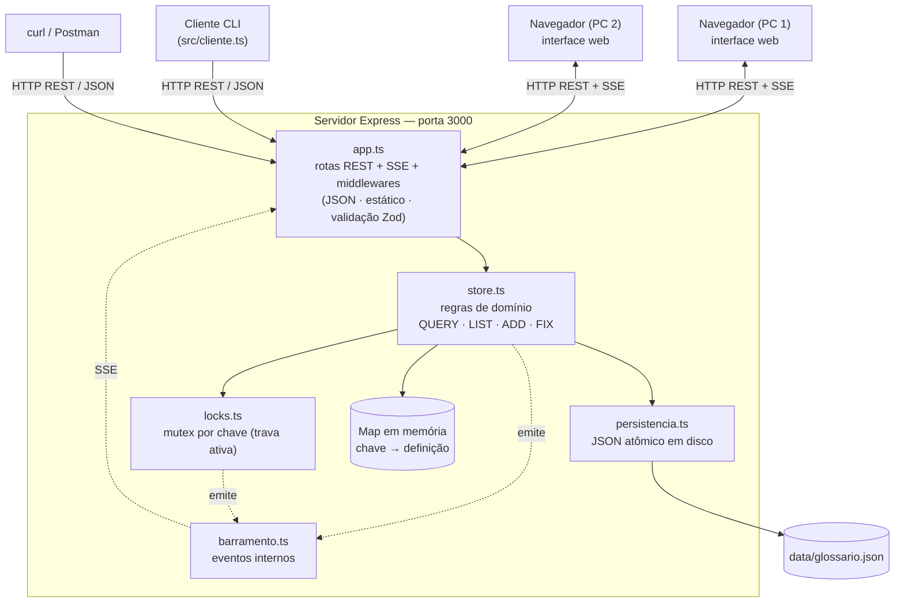
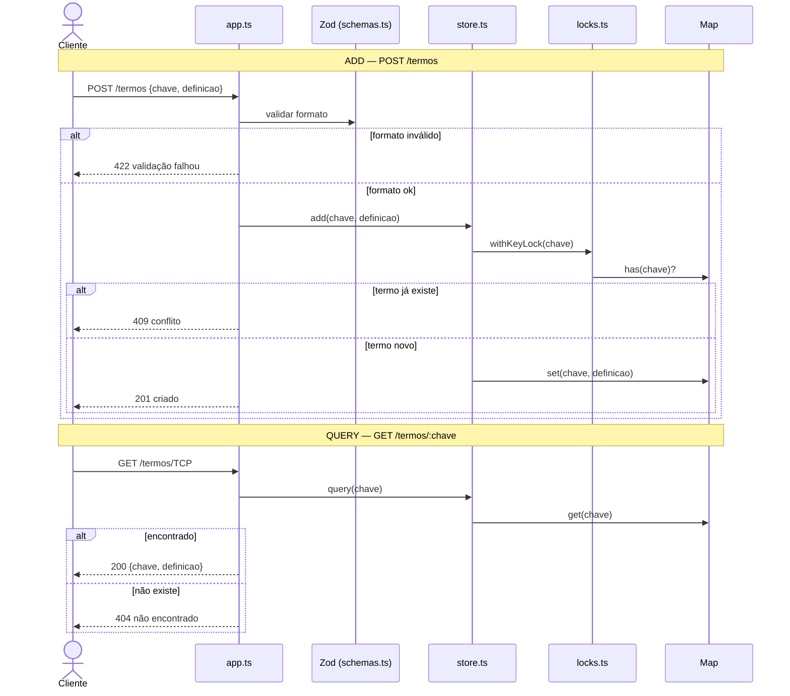
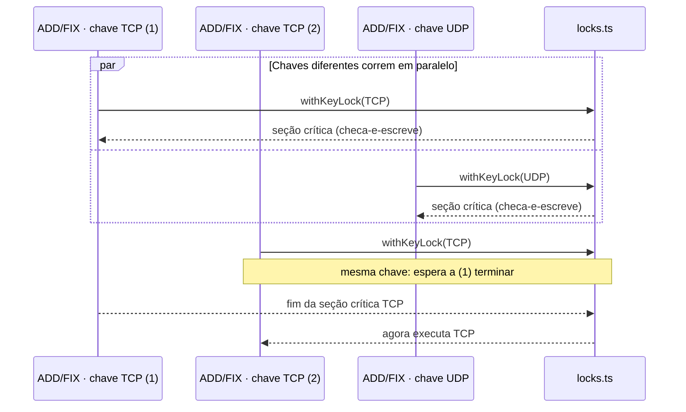
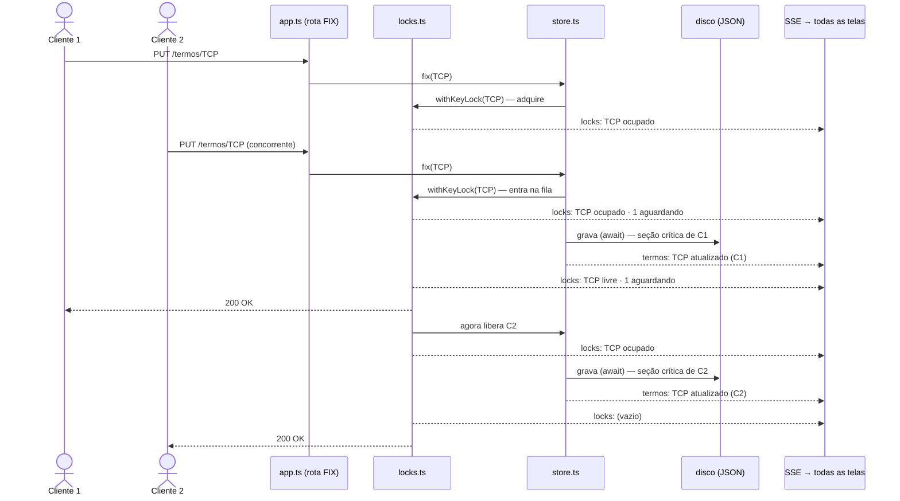

# Glossário Técnico Compartilhado

Projeto da disciplina de **Sistemas Distribuídos** (UFPE) — **Equipe 10**.

Nosso objetivo foi o da criação de um Servidor HTTP REST que mantém um **glossário de termos técnicos** (pares
`chave → definição`), atendendo a múltiplos clientes simultâneos por
meio das operações **QUERY**, **ADD**, **FIX** e **LIST**. É a reimplementação,
agora sobre um framework web, do mesmo sistema feito anteriormente com sockets.
Devido a natureza do projeto acadêmico, algumas informações serão atualizadas à medida que nosso escopo for aumentando gradualmente, com algumas informações sendo focadas na explicação dos pontos de avaliação estabelecidos, mas esperamos descrever de uma maneira clara nossas intenções.

> **Entrega 3 — Interface.** A **interface gráfica web** passa a ser o meio
> principal de interação (não mais o terminal): busca rápida (QUERY), painel de
> leitura, e formulários de inserção (ADD) e retificação (FIX). O estado é
> **persistido em disco** (sobrevive a reinícios), atualizado em **tempo real**
> na tela via **SSE** (sem refresh manual), e o comando **FIX tem trava
> (mutex) ativa no servidor**: enquanto um cliente retifica um termo, as demais
> alterações sobre **aquele mesmo termo** ficam retidas até a conclusão — com
> aviso visual de carregamento/bloqueio. Detalhes em
> [Interface gráfica](#interface-gráfica-entrega-3),
> [Persistência local](#persistência-local-entrega-3),
> [Tempo real (SSE)](#tempo-real-sse--entrega-3) e
> [Trava ativa no FIX](#trava-ativa-no-fix-e-demonstração-ao-vivo--entrega-3).

## Tecnologias escolhidas e justificativa

| Tecnologia | Papel | Por que |
|---|---|---|
| **Node.js + Express 5** | servidor HTTP / roteamento REST | Framework sugerido no enunciado; mapeia QUERY/ADD/FIX diretamente em GET/POST/PUT. O Express 5 encaminha erros de *handlers* `async` ao tratador de erros nativamente, o que mantém os handlers limpos. |
| **TypeScript** | tipagem estática | O compilador pega erros antes da execução, reduzindo checagem manual em runtime. |
| **Zod** | validação de formato | Valida o corpo das requisições e **infere o tipo a partir do mesmo schema** — uma fonte de verdade só para formato e tipo. |
| **tsx** | execução | Roda os arquivos `.ts` diretamente, sem etapa de *build*. |
| **SSE** (*Server-Sent Events*) | estado em tempo real | Empurra atualizações de lista e de travas para a interface sem *polling*; é HTTP puro (`text/event-stream`), **nativo do navegador** (`EventSource`) e do Node (`res.write`) — sem WebSocket nem dependências novas. |
| **`fs` + JSON** (Node) | persistência local | Grava o glossário em disco de forma **atômica** (arquivo temporário + `rename`); nativo, sem banco de dados. |

> A **Entrega 3 não adicionou nenhuma dependência nova**: SSE e persistência
> usam apenas recursos nativos do Node e do navegador.

A arquitetura é um **único servidor com estado central em memória**,
**persistido em disco**. A concorrência entre requisições é tratada com
**bloqueio por chave** (ver
[Estratégia de locking](#estratégia-de-locking-bloqueio-transacional)) e o
estado é difundido em tempo real para as interfaces via SSE.

## Arquitetura

Visão geral: clientes (o **navegador** com a interface web, o **cliente de linha
de comando** ou ferramentas como `curl`) conversam com um **único servidor
Express** pelo **protocolo REST/JSON**. O servidor é dividido em camadas de
responsabilidade única — entrada HTTP (`app.ts`), validação de formato
(`schemas.ts`), regras de domínio (`store.ts`) e controle de concorrência
(`locks.ts`) — sobre um estado central em memória (`Map`).

### Diagrama de componentes



### Funcionamento de cada elemento

| Elemento | Responsabilidade | Conversa com |
|---|---|---|
| `src/index.ts` | Ponto de entrada: **carrega a persistência** e sobe o servidor na porta fixa (`3000`). | `app.ts`, `store`, `persistencia` |
| `src/app.ts` | Camada HTTP: middlewares (JSON, arquivos estáticos, validação), rotas REST, **endpoint SSE `/eventos`** e o mapeamento de erro de domínio → status HTTP. | `schemas`, `store`, `locks`, `barramento` |
| `src/schemas.ts` | Valida o **formato** das entradas com Zod e infere os tipos do mesmo schema (uma fonte de verdade). | usado por `app` |
| `src/store.ts` | Mantém o estado (`Map`), **persiste em disco** e aplica as **regras de domínio**: unicidade no ADD, existência no FIX. Emite eventos de mudança. | `locks`, `persistencia`, `barramento`, `Map` |
| `src/locks.ts` | **Mutex por chave** (trava transacional ativa): serializa operações sobre o mesmo termo; chaves diferentes seguem em paralelo. **Rastreia e publica** o estado das travas (ocupada / fila). | `barramento`; usado por `store` |
| `src/persistencia.ts` | **Durabilidade**: carrega o glossário no início e grava em disco de forma **atômica e serializada**. | `fs` (disco); usado por `store` |
| `src/barramento.ts` | **Barramento de eventos** interno: desacopla quem produz mudanças (`store`/`locks`) de quem as difunde (SSE em `app`). | `store`, `locks`, `app` |
| `public/index.html` | **Interface web** (cliente) que consome a API por `fetch` e recebe estado em **tempo real** via `EventSource`. | API + SSE via HTTP |
| `src/cliente.ts` | **Cliente de linha de comando** que consome a API. | API via HTTP |
| `src/demo-concorrencia.ts` | Exercita o `withKeyLock` (nível unitário) para tornar a concorrência **visível**. | `locks` |
| `src/demo-fix.ts` | Demonstra **pelo HTTP** a serialização do FIX da mesma chave (e o paralelismo entre chaves). | API via HTTP |

### Fluxo de uma requisição (ADD e QUERY)



### Concorrência: mutex por chave



### FIX com trava ativa, persistência e tempo real (Entrega 3)

Dois clientes retificam o **mesmo** termo. O segundo fica **retido** na trava
até o primeiro concluir (incluindo a gravação em disco); enquanto isso, todas as
interfaces conectadas recebem o estado da trava por SSE.



> Os diagramas acima são escritos em **Mermaid** e renderizados automaticamente
> pelo GitHub na visualização do README.

## Estrutura de pastas

```
glossario-tecnico/
├── package.json          # dependências e scripts (dev / start / cliente / demo / demo:fix / carga / typecheck)
├── tsconfig.json         # TypeScript (ESM, strict, sem build)
├── README.md
├── data/                 # persistência local (criado em runtime; ignorado pelo git)
│   └── glossario.json    #   estado do glossário em disco
├── public/
│   └── index.html        # interface web (busca, leitura, formulários ADD/FIX; tempo real via SSE)
├── k6/
│   └── load-test.js          # teste de carga (k6)
├── vitest.config.ts          # configuração dos testes automatizados
└── src/
    ├── index.ts              # ponto de entrada: carrega a persistência e sobe o servidor
    ├── app.ts                # camada HTTP: middlewares, log por requisição, rotas REST e SSE
    ├── store.ts              # estado em memória (Map) + persistência + operações de domínio
    ├── locks.ts              # mutex por chave (trava ativa) + rastreio do estado das travas
    ├── persistencia.ts       # durabilidade: carrega/grava o JSON em disco (atômico, serializado)
    ├── barramento.ts         # barramento de eventos interno (store/locks → SSE)
    ├── schemas.ts            # schemas Zod + tipos inferidos
    ├── log.ts                # logger estruturado (logs operacionais)
    ├── cliente.ts            # cliente de linha de comando interativo (consome a API)
    ├── demo-concorrencia.ts  # demonstração do mutex (nível unitário)
    ├── demo-fix.ts           # demonstração HTTP do bloqueio do FIX (mesma chave serializa)
    ├── carga.ts              # carga concorrente p/ verificar isolamento via logs
    └── __tests__/
        ├── store.test.ts     # testes unitários do domínio
        ├── locks.test.ts     # testes do mutex por chave
        └── app.test.ts       # testes de integração HTTP
```

Cada arquivo tem uma responsabilidade única: `schemas` não conhece Express,
`store` não conhece HTTP, `locks` não conhece o domínio, `persistencia` não
conhece o domínio nem o HTTP, e o mapeamento HTTP↔domínio fica concentrado em
`app.ts`.

## Estrutura de dados em memória

O estado central é um único dicionário (`Map`) em `store.ts`:

```ts
const termos = new Map<string, string>();   // chave (termo) -> definição
```

- A **unicidade da chave** é garantida pela própria estrutura do `Map`.
- A regra de negócio de unicidade é aplicada no **ADD** (falha se a chave já
  existe) e a de existência no **FIX** (falha se a chave não existe).
- Esse `Map` é **espelhado em disco** (`data/glossario.json`) a cada ADD/FIX e
  recarregado na subida do servidor (ver [Persistência local](#persistência-local-entrega-3)).

O utilitário de bloqueio mantém uma estrutura auxiliar por chave em `locks.ts` —
além da "corrente" de promises, rastreia se a chave está ocupada e quantos
aguardam (para o feedback em tempo real):

```ts
interface Entrada {
  cauda: Promise<void>; // fim da corrente de operações desta chave
  ocupado: boolean;     // há uma operação na seção crítica
  aguardando: number;   // quantas operações esperam a liberação
}
const entradas = new Map<string, Entrada>();  // uma entrada por chave ativa
```

## Endpoints planejados

| Comando | Método e rota | Corpo (JSON) | Sucesso | Erros |
|---|---|---|---|---|
| **QUERY** | `GET /termos/:chave` | — | `200` `{ chave, definicao }` | `404` |
| **LIST** | `GET /termos` | — | `200` `[{ chave, definicao }]` | — |
| **ADD** | `POST /termos` | `{ chave, definicao }` | `201` `{ chave, definicao }` | `409`, `422` |
| **FIX** | `PUT /termos/:chave` | `{ definicao }` | `200` `{ chave, definicao }` | `404`, `422` |
| **REMOVE** | `DELETE /termos/:chave` | — | `200` `{ chave, definicao }` | `404` |
| (travas) | `GET /locks` | — | `200` `[{ chave, ocupado, aguardando }]` | — |
| (tempo real) | `GET /eventos` | — | `200` fluxo SSE (`event: termos` / `event: locks`) | — |
| (teste) | `GET /health` | — | `200` `{ status: "ok" }` | — |
| (web) | `GET /` | — | `200` página HTML (interface) | — |
| (índice) | `GET /api` | — | `200` `{ servico, endpoints }` | — |
| (busca) | `GET /termos?busca=texto` | — | `200` `[{ chave, definicao }]` | — |
| (métricas) | `GET /stats` | — | `200` `{ total_termos, total_queries, … }` | — |

Semântica dos comandos: **ADD só cria** (`409 Conflict` se o termo já existe) e
**FIX só atualiza** (`404 Not Found` se o termo não existe). Essa separação torna
a regra de unicidade visível no comportamento.

Códigos de status usados: `200` OK, `201` Created, `404` Not Found,
`409` Conflict, `422` Unprocessable Entity (falha de validação) e `500` para
erros inesperados. O corpo de erro tem o formato `{ "erro": "..." }`; o de
validação inclui também `detalhes` com os problemas reportados pelo Zod.

## Estratégia de locking (bloqueio transacional)

O requisito é garantir que a modificação de um termo **não seja sobreposta** por
outra requisição concorrente **sobre o mesmo termo**. A solução leva em conta o
modelo de execução do Node:

- O Node executa JavaScript em um **único *event loop***. Um trecho **síncrono**
  roda até o fim sem ser intercalado por outra requisição. Logo, um ADD/FIX que
  faça apenas operações síncronas em memória (`has` seguido de `set`) **já é
  atômico** — não há corrida entre a checagem e a escrita.
- A corrida só aparece quando a seção crítica **cede o controle num `await`**
  (por exemplo, ao persistir em disco/banco ou chamar outro serviço entre o
  "checa" e o "escreve"). É aí que duas requisições sobre a **mesma** chave podem
  se intercalar.

Por isso a estratégia é um **mutex por chave** (`src/locks.ts`): cada chave tem
uma "corrente" de promises; operações sobre a mesma chave são encadeadas e
executam **uma de cada vez**, enquanto chaves diferentes seguem **em paralelo**.
ADD e FIX rodam sob esse mutex; **QUERY e LIST são leitura pura e não usam lock**.

**Na Entrega 3 a trava passou a ser genuinamente ativa.** Como ADD/FIX agora
**persistem em disco** (I/O assíncrono) *dentro* da seção crítica, há um `await`
real entre o "checa" e o "conclui" — exatamente a janela em que duas requisições
sobre a **mesma** chave poderiam se intercalar. O mutex por chave fecha essa
janela:

- **FIX (bloqueio transacional exigido):** enquanto um cliente retifica `TCP`,
  qualquer outra retificação de `TCP` fica **retida** até a primeira concluir
  (escrita em disco inclusa). Retificações de `UDP` seguem em paralelo.
- **ADD (unicidade sob concorrência):** dois ADD simultâneos da mesma chave nova
  não criam duplicata — o segundo, ao assumir a trava, vê a chave já existente e
  recebe `409`.

O módulo `locks.ts` ainda **rastreia o estado de cada trava** (se está ocupada e
quantos aguardam) e **publica** esse retrato no barramento, de onde a interface o
recebe em tempo real (selo "🔒 sendo editado", painel de atividade e aviso de
fila). Veja a demonstração ao vivo em
[Trava ativa no FIX](#trava-ativa-no-fix-e-demonstração-ao-vivo--entrega-3).

## Validações

Feitas com Zod, antes do handler. Em falha, a resposta é `422` com a lista de
problemas.

- `chave`: texto não-vazio, com *trim*, no máximo 200 caracteres.
- `definicao`: texto não-vazio, com *trim*, no máximo 2000 caracteres.

Os espaços nas pontas são removidos (*trim*) antes de armazenar, então
`"  TCP  "` e `"TCP"` referem-se ao mesmo termo. As regras de negócio do domínio
(unicidade no ADD, existência no FIX) são verificadas no `store`.

## Como rodar

Requisitos: Node.js 18+ (testado no Node 22). **Nenhuma dependência externa além
do npm** (sem banco de dados).

```bash
npm install        # instala dependências
npm run dev        # sobe com auto-reload (tsx watch)
# ou
npm start          # sobe sem watch
npm run cliente    # cliente interativo (precisa do servidor rodando)
npm run demo       # demonstração do mutex por chave (não precisa do servidor)
npm run demo:fix   # demonstração HTTP do bloqueio do FIX (precisa do servidor)
npm run carga      # dispara requisições concorrentes p/ ver os logs de isolamento
npm run typecheck  # checagem de tipos (tsc --noEmit)
```

### Testes

```bash
npm test                # executa os 52 testes automatizados (store, locks, rotas HTTP)
npm run test:watch      # modo watch (re-executa ao salvar)
npm run test:coverage   # com relatório de cobertura
```

### Teste de carga (k6)

```bash
# requer k6 instalado: https://k6.io/docs/get-started/installation/
# com o servidor rodando em outro terminal:
k6 run k6/load-test.js
# resultado obtido: ~747 req/s · p(95)=4.6ms · 0 falhas em 29.907 requisições
```

O servidor sobe em `http://localhost:3000` — **abra esse endereço no navegador
para usar a interface web** (buscar, ler, adicionar e retificar termos). Os dados
são gravados em `data/glossario.json` (criado automaticamente) e **sobrevivem a
reinícios** do servidor.

### Variáveis de ambiente (opcionais)

| Variável | Padrão | Para que serve |
|---|---|---|
| `GLOSSARIO_DELAY_MS` | `0` | Atraso artificial na seção crítica de ADD/FIX. **Ligue para a demonstração ao vivo** (ex.: `2500`): alarga a janela em que a trava fica retida, tornando o bloqueio visível na tela. |
| `GLOSSARIO_DB` | `data/glossario.json` | Caminho do arquivo de persistência. |
| `GLOSSARIO_URL` | `http://localhost:3000` | Endereço do servidor usado pelos scripts (`cliente`, `carga`, `demo:fix`). |

## Interface gráfica (Entrega 3)

Ao abrir `http://localhost:3000`, o servidor entrega a interface
(`public/index.html`), que é o **meio principal de interação** com o sistema —
não mais o terminal. Ela consome a API por `fetch` e recebe o estado em tempo
real por `EventSource` (SSE). Todos os comandos das entregas anteriores estão na
tela, com feedback visual:

- **Buscar (QUERY)** — caixa de busca rápida por termo e **painel de leitura** da
  definição encontrada (ou aviso de "não encontrado").
- **Adicionar (ADD)** — formulário (termo + definição) com botão em estado de
  carregamento e mensagem de sucesso/erro.
- **Retificar (FIX)** — formulário dedicado (termo + nova definição). O botão
  "Retificar" de cada linha da tabela **preenche** este formulário. Mostra
  **estado de carregamento** ("Salvando…") e, se o termo estiver travado por
  outra edição, **"Aguardando liberação…"** com aviso de fila.
- **Lista (LIST)** — tabela que **atualiza sozinha em tempo real** (sem refresh):
  qualquer ADD/FIX de qualquer cliente aparece imediatamente em todas as telas.
- **Atividade no servidor** — painel que mostra as **travas ativas em tempo
  real** (qual termo está "🔒 em edição (seção crítica)" e quantos aguardam).
- **Selo de bloqueio** — a linha do termo em retificação exibe **"🔒 sendo
  editado · N na fila"** enquanto a trava está retida.
- **Status de conexão** — o cabeçalho indica "tempo real • conectado" ou
  "reconectando…" conforme a conexão SSE.
- **Tratamento de erros na própria interface** — rejeições do servidor (`404`,
  `409`, `422`), detalhes de validação do Zod e falhas de rede aparecem em um
  banner na tela, não só nos logs.

> A arquitetura não mudou de lugar: o estado vive no servidor (em memória +
> disco); a página é um cliente HTTP/SSE. O JSON com a lista de endpoints
> continua em `GET /api`.

## Persistência local (Entrega 3)

O glossário é **durável**: o estado é gravado em `data/glossario.json` e
**recarregado na subida** do servidor, sobrevivendo a reinícios.

- **Quando grava:** a cada ADD/FIX bem-sucedido, *dentro* da seção crítica da
  trava (por isso a trava passou a ser realmente necessária).
- **Gravação atômica:** escreve em `…json.tmp` e faz `rename` para o arquivo
  final — nunca deixa o arquivo pela metade, mesmo se o processo cair no meio.
- **Gravações serializadas:** uma corrente única garante que salvamentos
  concorrentes (de chaves diferentes, que rodam em paralelo) não percam
  atualizações no disco; cada gravação persiste o estado mais recente.
- **Tolerante a falhas:** se o arquivo não existir, começa vazio; se estiver
  corrompido, avisa nos logs e começa vazio (não derruba o servidor).

Verificar na prática: adicione termos pela interface, **reinicie** o servidor
(`Ctrl+C` e `npm start`) e veja que os termos continuam lá (o log de subida
mostra `persistencia.carregada … termos=N`).

## Tempo real (SSE) — Entrega 3

A interface recebe o estado **sem precisar atualizar manualmente**, por um fluxo
**SSE** em `GET /eventos` (HTTP puro, `text/event-stream`; sem WebSocket nem
bibliotecas). Ao conectar, o cliente recebe um retrato inicial e, depois, eventos
a cada mudança:

- `event: termos` → lista completa de termos (após ADD/FIX de qualquer cliente).
- `event: locks` → travas ativas (`[{ chave, ocupado, aguardando }]`).

Internamente, `store` e `locks` publicam no `barramento` (um `EventEmitter`); o
endpoint SSE se inscreve e repassa para cada cliente, cancelando a inscrição
quando a conexão fecha. Há um *fallback* por consulta periódica para navegadores
sem `EventSource`. Dá para inspecionar o fluxo no terminal:

```bash
curl -N http://localhost:3000/eventos     # fica aberto, imprimindo os eventos
curl    http://localhost:3000/locks       # retrato pontual das travas ativas
```

## Trava ativa no FIX e demonstração ao vivo — Entrega 3

A trava (mutex por chave) está **ativa na rota do FIX**: enquanto um cliente
retifica um termo, as demais alterações sobre **aquele mesmo termo** ficam
**retidas até a conclusão** (ver
[Estratégia de locking](#estratégia-de-locking-bloqueio-transacional)).

### Demonstração ao vivo (na interface, com dois computadores/abas)

1. Suba o servidor **com o atraso ligado** para alargar a janela de bloqueio:

   ```bash
   GLOSSARIO_DELAY_MS=2500 npm start
   # Windows (PowerShell):  $env:GLOSSARIO_DELAY_MS=2500; npm start
   ```

2. Abra a interface em **dois computadores** (ou duas abas/janelas) — veja
   [Acesso por múltiplos computadores](#acesso-por-múltiplos-computadores). Em um
   deles, adicione um termo (ex.: `TCP`); ele aparece **na hora** no outro.

3. No **Computador 1**, retifique `TCP` (botão "Retificar" na linha → "Salvar
   retificação"). Durante os ~2,5 s:
   - **Computador 1:** o botão fica em **"Salvando…"**.
   - **Computador 2:** a linha de `TCP` mostra **"🔒 sendo editado"** e o painel
     **"Atividade no servidor"** mostra `TCP` em **edição (seção crítica)**.

4. **Ainda dentro da janela**, no **Computador 2**, tente retificar `TCP` também:
   o botão vira **"Aguardando liberação…"** e a alteração só é aplicada **depois**
   que a do Computador 1 termina — provando o bloqueio transacional. O painel de
   atividade mostra `1 aguardando` durante a espera.

### Demonstração pelo HTTP (script)

Para comprovar a serialização pelo **tempo de resposta**, com o servidor no ar
(de preferência com `GLOSSARIO_DELAY_MS=1500`):

```bash
npm run demo:fix
```

Saída real (atraso de 1500 ms): na **mesma** chave os retornos saem **espaçados**
(serializados); em chaves **diferentes**, **juntos** (paralelos):

```text
── MESMA chave (TCP): 3 FIX concorrentes → devem SERIALIZAR ──
[ 3087ms] → A: enviou FIX TCP
[ 3088ms] → B: enviou FIX TCP
[ 3089ms] → C: enviou FIX TCP
[ 4596ms] ← A: status 200  (durou 1509ms)
[ 6099ms] ← B: status 200  (durou 3011ms)
[ 7600ms] ← C: status 200  (durou 4511ms)

── Chaves DIFERENTES (TCP, UDP): 2 FIX concorrentes → em PARALELO ──
[ 7600ms] → D: enviou FIX TCP
[ 7601ms] → E: enviou FIX UDP
[ 9107ms] ← D: status 200  (durou 1507ms)
[ 9108ms] ← E: status 200  (durou 1507ms)
```

## Acesso por múltiplos computadores

O servidor escuta em **todas as interfaces de rede** na porta `3000`, e a
interface usa **caminhos relativos** (`/termos`, `/eventos`), então qualquer
máquina **na mesma rede** acessa pelo IP do servidor — sem alterar o código.

1. **No computador que roda o servidor**, descubra o IP da rede local:

   ```bash
   # Linux/macOS
   hostname -I            # ou:  ip addr  /  ifconfig
   # Windows
   ipconfig               # use o "Endereço IPv4" (ex.: 192.168.0.42)
   ```

2. Suba o servidor (`npm start`) nesse computador.

3. **Nos outros computadores** (mesma rede Wi-Fi/LAN), abra no navegador:

   ```
   http://<IP-DO-SERVIDOR>:3000      # ex.: http://192.168.0.42:3000
   ```

   Todas as telas compartilham o **mesmo** glossário e se atualizam em tempo
   real. É essa a configuração usada na demonstração ao vivo do bloqueio do FIX.

> Se outra máquina não conectar, normalmente é o **firewall** do computador do
> servidor bloqueando a porta `3000` — libere-a (ou use a mesma rede, sem
> isolamento de clientes). Para um teste rápido sem segundo computador, use duas
> janelas/abas do navegador no mesmo PC.

## Exemplos via terminal (curl)

```bash
curl localhost:3000/health
# {"status":"ok"}

curl -X POST localhost:3000/termos \
  -H 'Content-Type: application/json' \
  -d '{"chave":"TCP","definicao":"Protocolo confiável e orientado a conexão."}'
# 201 {"chave":"TCP","definicao":"..."}

curl localhost:3000/termos/TCP
# 200 {"chave":"TCP","definicao":"..."}

curl -X PUT localhost:3000/termos/TCP \
  -H 'Content-Type: application/json' \
  -d '{"definicao":"Transmission Control Protocol."}'
# 200 {"chave":"TCP","definicao":"..."}

curl localhost:3000/termos
# 200 [{"chave":"TCP","definicao":"..."}]
```

> No Windows/PowerShell, o `curl` é um apelido para `Invoke-WebRequest` e não
> entende `-X`/`-H`/`-d`. Para evitar essa confusão, use a **interface web** ou o
> **cliente interativo** abaixo (funcionam igual em qualquer sistema operacional).

## Cliente interativo (sem precisar de curl)

O servidor é uma **API REST**: o terminal onde roda `npm run dev` é *apenas o
servidor* e não lê comandos digitados. Para interagir sem montar requisições à
mão, o `src/cliente.ts` lê comandos e faz o HTTP por baixo — no mesmo espírito do
cliente das atividades de socket.

Com o servidor rodando em um terminal, abra **outro** terminal e execute:

```bash
npm run cliente
```

Exemplo de sessão:

```
glossário> ADD TCP Protocolo confiável e orientado a conexão.
  TCP → Protocolo confiável e orientado a conexão.
glossário> QUERY TCP
  TCP → Protocolo confiável e orientado a conexão.
glossário> FIX TCP Transmission Control Protocol.
  TCP → Transmission Control Protocol.
glossário> LIST
  TCP → Transmission Control Protocol.
glossário> SAIR
```

Comandos: `ADD <chave> <definição>`, `FIX <chave> <definição>`, `QUERY <chave>`,
`LIST`, `HELP`, `SAIR`. A `<chave>` é uma única palavra; o restante da linha é a
definição. O endereço do servidor pode ser trocado pela variável de ambiente
`GLOSSARIO_URL` (padrão `http://localhost:3000`).

## Demonstração de concorrência (mutex por chave)

Como os handlers são síncronos, a serialização do lock não aparece numa
requisição HTTP comum. Para tornar a estratégia de bloqueio **visível**, o
`src/demo-concorrencia.ts` exercita o `withKeyLock` diretamente, com atrasos
artificiais:

```bash
npm run demo
```

Ele imprime uma linha do tempo de três cenários:

1. **Mesma chave → serializa**: operações sobre a mesma chave rodam uma de cada
   vez (A1 → A2 → A3).
2. **Chaves diferentes → em paralelo**: chaves distintas não se bloqueiam.
3. **Erro não quebra a corrente**: se uma operação falha no meio, as seguintes
   sobre a mesma chave ainda executam.

É a forma prática de comprovar o "plano de bloqueios transacionais" exigido.

## Logs operacionais e isolamento (Entrega 2)

O servidor emite **logs estruturados** no console: uma linha por evento, no
formato `<timestamp ISO> [NÍVEL] <evento> campo=valor ...`. Para cada requisição
há um par `req.recebida` / `req.concluida` com **id próprio**, **cliente** (IP),
**método+rota**, **chave** (quando há), **status**, **duração (ms)** e o contador
**`em_voo`** (requisições em andamento naquele instante).

### Como verificar o isolamento das requisições paralelas

1. Suba o servidor em um terminal:

   ```bash
   npm start
   # dica: para evidenciar o paralelismo, ligue um atraso artificial (simula I/O):
   # aí chaves DIFERENTES rodam em paralelo e a MESMA chave serializa pelo mutex.
   GLOSSARIO_DELAY_MS=80 npm start
   ```

2. Em outro terminal, gere carga concorrente (vários ADD/QUERY simultâneos sobre
   chaves diferentes):

   ```bash
   npm run carga
   ```

3. Observe os logs do servidor. Em chaves **diferentes**, as requisições são
   recebidas juntas e `em_voo` sobe (rodam em paralelo, sem conflito), todas
   terminando com sucesso. Sobre a **mesma** chave, o mutex as serializa
   (terminam uma após a outra). Exemplo real (com o atraso ligado):

   ```text
   [INFO] req.recebida  req=2 metodo="POST" rota="/termos" cliente="127.0.0.1" em_voo=1
   [INFO] req.recebida  req=3 metodo="POST" rota="/termos" cliente="127.0.0.1" em_voo=2
   [INFO] req.recebida  req=4 metodo="POST" rota="/termos" cliente="127.0.0.1" em_voo=3
   [INFO] req.concluida req=2 metodo="POST" rota="/termos" chave="TCP" status=201 ms=83.3 em_voo=2
   [INFO] req.concluida req=3 metodo="POST" rota="/termos" chave="UDP" status=201 ms=81.3 em_voo=1
   [INFO] req.concluida req=4 metodo="POST" rota="/termos" chave="IP"  status=201 ms=81.0 em_voo=0
   ```

   O `em_voo > 1` em chaves diferentes evidencia o paralelismo; cada `req=`
   distinto, com sua `chave=` e `status=`, mostra que **não há conflito** entre elas.

## Status da Entrega 1

- [x] Decisão tecnológica documentada e justificada (seção *Tecnologias*).
- [x] Repositório organizado com README (descrição, tecnologias, estrutura, como rodar).
- [x] Estado central em memória modelado (`Map<string, string>`).
- [x] Protocolo de comunicação definido (rotas REST, formatos de request/response, códigos de status).
- [x] Servidor base rodando na porta fixa, com rota de teste (`GET /health`).
- [x] Validações de formato e regras de negócio (Zod + unicidade/existência no store).
- [x] Plano de bloqueios transacionais (mutex por chave, em `src/locks.ts`).

Além do mínimo exigido, a entrega inclui uma **interface web** (`GET /`), um
**cliente de linha de comando** (`npm run cliente`) para interação sem `curl` e
uma **demonstração executável do mutex por chave** (`npm run demo`).

## Status da Entrega 2 — Comunicação e Core

- [x] Servidor multicliente funcional (Express/Node, conexões concorrentes, em execução contínua).
- [x] Comandos principais operáveis via console/terminal (`npm run cliente` + `curl`).
- [x] Lógica de negócio central em memória (ADD/QUERY/FIX/LIST no `store.ts`).
- [x] Comunicação concorrente sem bloquear (HTTP assíncrono — sem necessidade de WebSocket/MQTT/gRPC).
- [x] Logs operacionais estruturados (requisições, cliente, operações, status, duração, `em_voo`).
- [x] Isolamento das requisições paralelas verificável pelos logs (`npm run carga`, opcional `GLOSSARIO_DELAY_MS`).
- [x] README atualizado com exemplos de ADD/QUERY e como verificar os logs de isolamento.

## Status da Entrega 3 — Interface

- [x] **Interface gráfica funcional e integrada** (web), conectada ao servidor e como meio principal de interação.
- [x] **Todos os comandos acessíveis pela interface** com feedback visual: busca rápida (QUERY) + painel de leitura, formulários de ADD e FIX.
- [x] **Trava (mutex) ativa no servidor na rota do FIX**: retificações sobre o mesmo termo são serializadas (as demais aguardam); chaves diferentes seguem em paralelo.
- [x] **Persistência local**: glossário gravado em disco (JSON atômico) e recarregado na subida — durável entre reinícios.
- [x] **Feedback visual de estado em tempo real** (SSE): lista, selo "🔒 sendo editado", fila e painel de atividade — sem refresh manual.
- [x] **Mensagens de carregamento/bloqueio** na interface durante a retificação ("Salvando…" / "Aguardando liberação…").
- [x] **Tratamento de erros na interface** (rejeições do servidor, validação e falhas de rede exibidas na tela).
- [x] **README** com instruções de instalação, execução, **acesso por múltiplos computadores** e **demonstração ao vivo do bloqueio transacional do FIX** (`GLOSSARIO_DELAY_MS` + `npm run demo:fix`).
- [x] **Testes automatizados** (Vitest + Supertest): 52 testes cobrindo store, locks e rotas HTTP — incluindo teste de concorrência HTTP que documenta a serialização do FIX com `em_voo=2` nos logs.
- [x] **Teste de carga** (k6): ~747 req/s, p(95)=4,6ms, 0 falhas em 29.907 requisições com 50 usuários simultâneos.
- [x] **Busca por substring** (`GET /termos?busca=texto`): filtra por chave ou definição, case-insensitive.
- [x] **Remoção de termos** (`DELETE /termos/:chave`): remove com serialização por lock — concorrência DELETE+ADD documentada por teste.
- [x] **Métricas de uso** (`GET /stats`): total de termos, queries, adições, retificações, buscas e uptime — exibidas em card na interface.
- [x] **Correção de normalização**: `req.params.chave` passa por trim antes de chegar ao store, alinhando o comportamento da URL ao do corpo JSON (Zod).

## Equipe do Projeto

<div align="center">

  <table>
    <tr>
      <td align="center">
        <br/>
        <b>Bruno Ramos</b>
      </td>
      <td align="center">
        <br/>
        <b>Flávia Vitória</b>
      </td>
      <td align="center">
        <br/>
        <b>Felipe Berardo</b>
      </td>
      <td align="center">
        <br/>
        <b>Diogo Rodrigues</b>
      </td>
      <td align="center">
        <br/>
        <b>Gryghor Camonni</b>
      </td>
    </tr>
  </table>

</div>

---

<p align="center">
  &copy; 2026 Universidade Federal de Pernambuco - Centro de Informática. Todos os direitos reservados.
</p>


